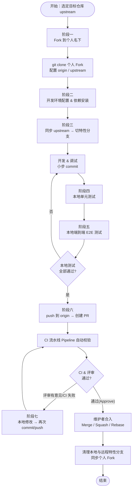
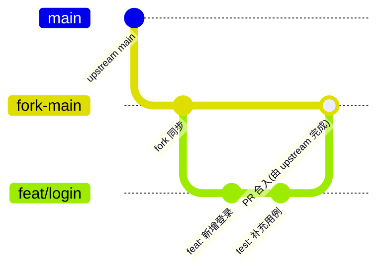
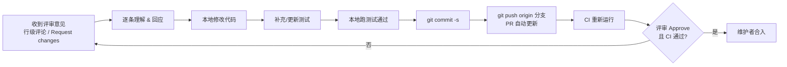

# 基于 Fork 模式的 GitCode PR 开发流程指南

> 适用平台：[GitCode](https://gitcode.com)　|　协作模式：**Fork + Pull Request**
> 内容来源：**GitCode 官方帮助文档** + **业界推荐的开源协作实践**
> 维护说明：文中标注「官方」的步骤来自 GitCode 帮助文档；标注「业界实践」的内容为社区通行做法（GitCode 基础文档未强制，但强烈建议遵循）。

---

## 目录

1. [文档说明与适用范围](#1-文档说明与适用范围)
2. [总览：Fork 模式 PR 全流程](#2-总览fork-模式-pr-全流程)
3. [阶段一：代码仓下载（Fork + Clone + 配置远程）](#3-阶段一代码仓下载fork--clone--配置远程)
4. [阶段二：开发环境配置](#4-阶段二开发环境配置)
5. [阶段三：创建特性分支与开发调试](#5-阶段三创建特性分支与开发调试)
6. [阶段四：本地单元测试](#6-阶段四本地单元测试)
7. [阶段五：本地端到端（E2E）测试](#7-阶段五本地端到端e2e测试)
8. [阶段六：推送并提交 PR 审核](#8-阶段六推送并提交-pr-审核)
9. [阶段七：处理评审意见、再次提交与合入](#9-阶段七处理评审意见再次提交与合入)
10. [各阶段最佳实践速查表](#10-各阶段最佳实践速查表)
11. [常用命令速查（Cheat Sheet）](#11-常用命令速查cheat-sheet)
12. [常见问题 FAQ](#12-常见问题-faq)
13. [参考资料](#13-参考资料)

---

## 1. 文档说明与适用范围

### 1.1 适用对象

- 向 GitCode 上的**开源项目 / 团队公共仓库**贡献代码，但**没有直接 push 权限**的开发者。
- 希望以**规范、可追溯、可回滚**的方式参与协作的团队成员。

### 1.2 Fork 模式 vs 分支模式

| 维度 | Fork 模式（本指南） | 分支模式（Branch） |
| --- | --- | --- |
| 写入权限 | 不需要原仓库写权限，先 Fork 到个人名下 | 需要原仓库写权限 |
| 隔离性 | 强，个人 Fork 与原仓库完全隔离 | 弱，分支都在同一仓库 |
| 适用场景 | 开源贡献、跨团队协作、外部贡献者 | 小型内部团队、强信任成员 |
| 合入方式 | 跨仓库 Pull Request（fork → upstream） | 同仓库 Pull Request |

> **官方**：GitCode 同时支持 Fork 工作流与轻量级 Pull Request；Fork 工作流特别适用于开源项目和团队协作。

### 1.3 前置准备（一次性）

1. **注册 GitCode 账号**并完成实名/邮箱配置。
2. **配置 SSH Key**（业界实践，推荐）：本地生成密钥并添加到 GitCode「设置 → SSH 公钥」。

   ```bash
   ssh-keygen -t ed25519 -C "your_email@example.com"
   cat ~/.ssh/id_ed25519.pub        # 复制内容粘贴到 GitCode SSH 公钥设置
   ssh -T git@gitcode.com            # 测试连通性
   ```

3. **配置 Git 身份信息**（提交记录必须与账号一致，便于评审与 DCO 校验）：

   ```bash
   git config --global user.name  "Your Name"
   git config --global user.email "your_email@example.com"
   # 推荐：拉取时默认 rebase，保持线性历史（业界实践）
   git config --global pull.rebase true
   ```

4. **阅读目标项目的 `README` / `CONTRIBUTING` / `CODE_OF_CONDUCT`**，确认其分支策略、提交规范、是否要求 DCO 签署、CI 要求等。

---

## 2. 总览：Fork 模式 PR 全流程

### 2.1 全流程图（Mermaid flowchart）



### 2.2 仓库与分支关系图（Mermaid gitGraph）



> 说明：实际合入发生在 **upstream 仓库**，上图用 `fork-main` 合并示意「PR 被接受」这一逻辑结果；个人 Fork 的 `main` 应始终作为 upstream 的干净镜像。

### 2.3 阶段一览表

| 阶段 | 目标 | 关键操作 | 关键产物 |
| --- | --- | --- | --- |
| 一 代码仓下载 | 获取代码并建立远程关系 | Fork、clone、配置 origin/upstream | 本地仓库 + 双远程 |
| 二 环境配置 | 可构建可运行 | 安装依赖、装钩子、装工具链 | 可构建的本地环境 |
| 三 分支与开发 | 隔离地实现需求 | 同步 upstream、切分支、编码调试 | 特性分支 + 提交 |
| 四 单元测试 | 验证最小单元正确 | 运行单测、查覆盖率 | 绿色单测 |
| 五 E2E 测试 | 验证端到端链路 | 起依赖、跑端到端用例 | 绿色 E2E |
| 六 提交 PR | 发起评审 | push、创建 PR、填模板、等 CI | 待评审 PR |
| 七 评审与合入 | 修复并合入 | 回应评论、再提交、rebase、合并 | 合入 upstream |

---

## 3. 阶段一：代码仓下载（Fork + Clone + 配置远程）

**目标**：把目标仓库（upstream）复制到个人名下（origin），克隆到本地，并建立 `origin`/`upstream` 双远程关系。

### 3.1 操作步骤

**① Fork 仓库（官方）**
打开目标项目页面，点击右上角 **「Fork」** 按钮，在个人账号下创建副本。

**② 克隆个人 Fork（官方）**

```bash
# HTTPS（无需 SSH 配置，首次简单）
git clone https://gitcode.com/<your-username>/<repo>.git

# SSH（推荐，免反复输密码，业界实践）
git clone git@gitcode.com:<your-username>/<repo>.git

cd <repo>
```

**③ 配置 upstream 远程（业界实践——基础文档未显式给出，强烈建议）**

```bash
# origin 默认指向你的 Fork；再添加原仓库为 upstream
git remote add upstream git@gitcode.com:<original-org>/<repo>.git

# 校验：应同时看到 origin（你的 fork）与 upstream（原仓库）
git remote -v
# origin    git@gitcode.com:<your-username>/<repo>.git (fetch/push)
# upstream  git@gitcode.com:<original-org>/<repo>.git  (fetch/push)

# 可选：禁止误向 upstream push（保护原仓库）
git remote set-url --push upstream DISABLE
```

### 3.2 最佳实践

- ✅ **SSH 优先**：避免每次推送输入账号密码 / Token。
- ✅ **`main` 永远是 upstream 的干净镜像**：不在个人 Fork 的 `main` 上直接开发或提交。
- ✅ **命名约定**：`origin` = 个人 Fork，`upstream` = 原仓库，全团队统一，沟通无歧义。

### 3.3 常见坑

- ❌ 直接 clone 了**原仓库**而非个人 Fork → 没有 push 权限，后续无法推送分支。务必 clone `your-username` 名下的副本。
- ❌ 忘记加 `upstream` → 后续无法同步上游最新代码，PR 容易产生冲突。

---

## 4. 阶段二：开发环境配置

**目标**：让本地能成功**构建、运行、测试**项目。

### 4.1 通用步骤

1. **读文档**：优先按 `README` / `CONTRIBUTING` / `docs/` 的「环境要求」「快速开始」执行。
2. **对齐工具链版本**：JDK / Node / Python / Go 等版本需与项目声明一致（建议用 `sdkman`、`nvm`、`pyenv`、`gvm` 管理多版本）。
3. **安装依赖**（见下方多栈示例）。
4. **安装预提交钩子**（业界实践，强烈推荐）：在提交前自动跑格式化/静态检查，减少 CI 来回。

   ```bash
   # 以 pre-commit 框架为例（多语言通用）
   pip install pre-commit
   pre-commit install
   pre-commit run --all-files   # 首次全量检查
   ```

### 4.2 多栈示例

```bash
# —— Java / Maven ——
mvn -v
mvn clean install -DskipTests        # 构建并安装依赖（先跳过测试加快首次构建）

# —— Java / Gradle ——
./gradlew build -x test

# —— Node.js / 前端 ——
node -v && npm -v
npm install            # 或 pnpm install / yarn install（以 lockfile 为准）

# —— Python ——
python -m venv .venv && source .venv/bin/activate   # Windows: .venv\Scripts\activate
pip install -e ".[dev]"   # 可编辑安装 + 开发依赖；或 pip install -r requirements.txt

# —— Go ——
go version
go mod download        # 拉取依赖
go build ./...         # 验证可构建
```

### 4.3 最佳实践

- ✅ **锁定依赖版本**：尊重 `pom.xml` / `package-lock.json` / `pnpm-lock.yaml` / `poetry.lock` / `go.sum`，不随意升级。
- ✅ **本地工具与 CI 对齐**：本地的 lint/format/test 命令尽量与 CI 流水线一致，避免「本地过、CI 挂」。
- ✅ **隔离环境**：Python 用 venv、Node 用本地 `node_modules`，避免污染全局。

### 4.4 常见坑

- ❌ 全局安装依赖导致版本冲突。
- ❌ 跳过 `CONTRIBUTING` 直接构建，错过项目特有的初始化脚本（如 `make setup`、`scripts/bootstrap`）。

---

## 5. 阶段三：创建特性分支与开发调试

**目标**：在与上游同步的最新代码基础上，**新建特性分支**进行隔离开发。

### 5.1 操作步骤

**① 开发前先同步 upstream（业界实践，关键）**

```bash
git checkout main
git fetch upstream                 # 拉取上游最新
git rebase upstream/main           # 让本地 main 与上游对齐（或 git merge --ff-only）
git push origin main               # 顺手更新个人 Fork 的 main
```

**② 基于最新代码切特性分支**

```bash
# 直接从 upstream/main 切，确保起点最新
git fetch upstream
git switch -c feat/user-login upstream/main
# 旧版 Git: git checkout -b feat/user-login upstream/main
```

**③ 开发并小步提交**

```bash
git add <changed-files>
git commit -s -m "feat(login): 支持手机号登录"   # -s 自动加 Signed-off-by（DCO）
```

### 5.2 分支命名规范（业界实践）

| 前缀 | 用途 | 示例 |
| --- | --- | --- |
| `feat/` | 新功能 | `feat/oauth-login` |
| `fix/` | 缺陷修复 | `fix/npe-on-logout` |
| `docs/` | 文档 | `docs/api-readme` |
| `refactor/` | 重构 | `refactor/order-service` |
| `test/` | 测试 | `test/login-e2e` |
| `chore/` | 杂项/构建 | `chore/bump-deps` |

### 5.3 提交信息规范：Conventional Commits（业界实践）

格式：`<type>(<scope>): <subject>`，正文说明「做了什么、为什么」。

```text
feat(login): 新增手机号验证码登录

- 增加 SmsCodeAuthProvider
- 验证码 5 分钟有效，错误 5 次锁定

Closes #123
Signed-off-by: Your Name <your_email@example.com>
```

- **DCO 签署**：若项目要求 DCO，每个 commit 需含 `Signed-off-by` 行 → 用 `git commit -s` 自动添加。
- **小步提交**：一个 commit 只做一件事，便于评审与回滚。

### 5.4 调试最佳实践

- ✅ **善用 IDE 调试器**：断点、条件断点、变量观察优于 `print` 满天飞。
- ✅ **结构化日志**：调试日志加开关，提交前清理临时调试输出。
- ✅ **最小复现**：定位问题时写最小可复现用例，往往可直接转化为单元测试。

### 5.5 常见坑

- ❌ 在 `main` 上直接改 → 难以同步上游、PR 混入无关变更。**永远在特性分支开发**。
- ❌ 一个分支塞进多个不相关需求 → 评审困难、合入风险高。**一分支一主题**。

---

## 6. 阶段四：本地单元测试

**目标**：在提交前用单元测试验证**最小代码单元**的正确性，把问题挡在本地。

### 6.1 多栈命令

```bash
# —— Java / Maven ——
mvn test                                  # 全量单测
mvn -Dtest=LoginServiceTest test          # 只跑指定类
mvn jacoco:report                         # 覆盖率报告（需配置 JaCoCo 插件）

# —— Node.js ——
npm test                                  # 一般映射到 jest / vitest
npx jest src/login --coverage             # 跑子目录 + 覆盖率
npx vitest run                            # vitest 一次性运行

# —— Python ——
pytest                                    # 全量
pytest tests/test_login.py -k "verify"    # 按文件/关键字筛选
pytest --cov=app --cov-report=term-missing  # 覆盖率

# —— Go ——
go test ./...                             # 全量
go test ./auth/ -run TestLogin -v         # 指定包/用例
go test ./... -cover                      # 覆盖率
```

### 6.2 最佳实践

- ✅ **提交前必过本地单测**（业界实践硬性约定）：本地全绿再 push，减少 CI 来回。
- ✅ **改动相关用例优先**：开发中先跑受影响的用例快速反馈，push 前再跑全量。
- ✅ **遵循测试金字塔**：单元测试数量最多、最快、最稳；E2E 最少、最贵。
- ✅ **新增/修复都配测试**：新功能补充用例，修 Bug 先写复现用例（红 → 绿）。
- ✅ **关注覆盖率但不唯覆盖率**：覆盖核心分支与边界条件比追求数字更重要。

### 6.3 常见坑

- ❌ 用例依赖外部网络/真实数据库 → 不稳定。单测应**隔离依赖**（Mock / Stub）。
- ❌ 用例之间互相依赖执行顺序 → 应保证**可独立、可重复**运行。

---

## 7. 阶段五：本地端到端（E2E）测试

**目标**：在贴近真实运行的环境中，验证**完整业务链路**（UI/API → 服务 → 数据），覆盖单测无法发现的集成问题。

### 7.1 准备运行依赖（业界实践，推荐容器化）

```bash
# 用 docker compose 一键拉起数据库 / 缓存 / 依赖服务，保证环境可复现
docker compose -f docker-compose.test.yml up -d
# ... 运行 E2E ...
docker compose -f docker-compose.test.yml down -v   # 跑完清理，避免脏数据
```

### 7.2 多栈示例

```bash
# —— Web 前端（Playwright）——
npx playwright install            # 首次安装浏览器
npx playwright test               # 运行 E2E
npx playwright test --ui          # 调试模式（可视化）

# —— Web 前端（Cypress）——
npx cypress run                   # 无头运行
npx cypress open                  # 交互式调试

# —— 后端 / API 端到端（Python）——
pytest tests/e2e -m e2e           # 用 marker 区分 e2e 用例

# —— 后端服务（Java，先起服务再跑端到端）——
mvn spring-boot:run &             # 启动被测服务
mvn verify -Pe2e                  # 运行 e2e profile（如 failsafe 集成测试）

# —— 通用 API 冒烟（脚本化）——
curl -fsS http://localhost:8080/health   # 健康检查作为最小 E2E 冒烟
```

### 7.3 最佳实践

- ✅ **环境可复现**：依赖用容器固定版本，避免「我机器能跑」。
- ✅ **数据隔离与清理**：每次用例自建数据、结束即清理，保证可重复。
- ✅ **与 CI 一致**：本地 E2E 命令尽量与流水线相同，减少环境差异。
- ✅ **聚焦关键路径**：E2E 慢且脆，优先覆盖核心业务流程（登录、下单、支付等）。

### 7.4 常见坑

- ❌ E2E 直连生产或共享环境 → 污染数据、互相干扰。务必用**独立测试环境**。
- ❌ 用例耦合具体时序/随机数据导致 flaky（偶发失败）→ 加重试或固定测试数据。

---

## 8. 阶段六：推送并提交 PR 审核

**目标**：把本地特性分支推到个人 Fork，并向 upstream 发起 **Pull Request** 进入评审。

### 8.1 提交前自检清单（业界实践）

```text
□ 已 rebase 到 upstream/main 最新代码，无冲突
□ 本地单元测试全部通过
□ 本地端到端/集成测试通过（如适用）
□ 代码格式化 & 静态检查（lint）通过
□ commit 信息符合规范；如需 DCO，每个 commit 含 Signed-off-by
□ 删除调试代码、临时文件、敏感信息（密钥/口令）
□ 已更新相关文档 / CHANGELOG（如项目要求）
```

### 8.2 推送分支（官方）

```bash
git push origin feat/user-login
```

### 8.3 创建 Pull Request（官方）

1. 打开**原仓库（upstream）页面**，点击 **「+ New Pull Request / 新建合并请求」**。
2. 设置比较：**base = `upstream/main`**，**compare = `your-username:feat/user-login`**。
3. 填写**标题与描述**：清晰说明「做了什么、为什么、怎么验证、影响范围」。
4. 进阶设置（官方支持）：
   - **关联 Issue**：描述中写 `Closes #123` / `Fixes #123`，合入时自动关闭。
   - **草稿 PR（Draft）**：尚未完成时标记为草稿，先让 CI 跑、先收集早期反馈。
   - **指定 Reviewer**：邀请相关维护者评审，可用 `@用户名` 提及。
   - **打标签 / 关联里程碑**：便于分类与进度跟踪。

#### PR 描述模板（可直接复制）

```markdown
## 变更说明
<!-- 这个 PR 做了什么 -->

## 变更动机 / 关联 Issue
Closes #<issue-id>

## 实现方案
<!-- 关键设计、取舍 -->

## 测试情况
- [ ] 单元测试已补充并通过
- [ ] 端到端 / 集成测试通过
- [ ] 手动验证步骤：<...>

## 影响范围 & 兼容性
<!-- 是否有破坏性变更、迁移说明 -->

## 自检
- [ ] 已 rebase 上游最新
- [ ] commit 已 Signed-off-by（如需 DCO）
- [ ] 无敏感信息泄露
```

### 8.4 关注 CI 流水线（官方 Pipeline）

- PR 创建后，GitCode **Pipeline（CI/CD）** 会自动触发构建/测试。
- **确保流水线全绿**再请求评审；红灯先自查日志修复。

### 8.5 最佳实践

- ✅ **PR 体量适中**：小而聚焦的 PR 评审快、合入风险低。
- ✅ **标题即摘要**：遵循 Conventional Commits 风格，一眼看懂意图。
- ✅ **描述写清验证方式**：方便评审者复现与判断。

---

## 9. 阶段七：处理评审意见、再次提交与合入

**目标**：根据评审反馈修改代码、再次提交更新 PR，直至通过并被维护者合入。

### 9.1 评审—修改循环图（Mermaid）



### 9.2 处理评审意见（官方）

- GitCode 代码评审支持**行级评论、代码块评论、@ 提及、Approve / Request changes、解决讨论（Resolve）**。
- **逐条回应**：同意则修改并回复「已修复（commit 链接）」；有异议则礼貌讨论、达成一致。
- 修改后在对应评论处标记 **Resolve**，保持讨论区清爽。

### 9.3 再次提交（更新 PR）

```bash
# 在同一特性分支上修改
git add <files>
git commit -s -m "fix(login): 按评审意见补充空值校验"

# 可选：把修订并入对应提交，保持历史整洁（业界实践）
# git commit --fixup <commit-hash>
# git rebase -i --autosquash upstream/main

git push origin feat/user-login        # 推送后 PR 自动更新，无需重开
```

### 9.4 同步上游并解决冲突（业界实践）

当 PR 存在期间上游有新提交、或出现冲突时：

```bash
git fetch upstream
git rebase upstream/main               # 在最新上游之上重放你的提交
# 出现冲突：编辑解决 → git add <files> → git rebase --continue
git push --force-with-lease origin feat/user-login   # 安全强推，更新 PR
```

> ⚠️ 用 `--force-with-lease` 而非 `--force`：当远程分支被他人更新时会拒绝覆盖，防止误丢提交。

### 9.5 合入与收尾（官方合并策略）

维护者（或具备权限者）按项目约定选择合并策略：

| 策略 | 效果 | 适用 |
| --- | --- | --- |
| **普通合并 Merge** | 保留完整提交历史 + 合并提交 | 需保留细粒度历史 |
| **Squash 合并** | 把 PR 全部提交压成一个提交 | 追求干净线性历史（常见默认） |
| **Fast-forward** | 线性快进，无合并提交 | 历史已线性、无分叉 |
| **Cherry-pick / Revert** | 选择性应用 / 回滚 | 挑拣特定提交、回滚合并 |

**合入后收尾（贡献者侧）**：

```bash
git checkout main
git fetch upstream && git rebase upstream/main   # 同步最新（含刚合入的代码）
git push origin main                             # 更新个人 Fork 的 main

git branch -d feat/user-login                    # 删除本地特性分支
git push origin --delete feat/user-login         # 删除 Fork 上的远程分支
```

### 9.6 最佳实践

- ✅ **及时响应评审**：缩短反馈周期，趁热打铁。
- ✅ **修改即配测试**：评审发现的问题尽量补一个用例，防止回归。
- ✅ **保持 PR 更新但不重开**：同分支 push 即可更新 PR，避免新建 PR 丢失讨论历史。

### 9.7 常见坑

- ❌ 用 `git push --force` 误覆盖协作者提交 → 改用 `--force-with-lease`。
- ❌ 评审意见只改代码不回应 → 评审者无法跟踪，应逐条回复并 Resolve。

---

## 10. 各阶段最佳实践速查表

| 阶段 | ✅ Do（推荐） | ❌ Don't（避免） |
| --- | --- | --- |
| 代码仓下载 | clone 个人 Fork；配 origin/upstream；SSH 优先 | clone 原仓库；忘配 upstream |
| 环境配置 | 对齐工具链版本；装 pre-commit；本地与 CI 一致 | 全局装依赖；跳过 CONTRIBUTING |
| 分支与开发 | 同步上游后切分支；一分支一主题；规范 commit | 在 main 上改；混合多需求 |
| 单元测试 | 提交前全绿；新增/修复都配用例；隔离依赖 | 用例依赖网络/顺序；跳过测试 |
| E2E 测试 | 容器化依赖；数据隔离清理；聚焦核心链路 | 连生产/共享环境；放任 flaky |
| 提交 PR | 小而聚焦；填模板写验证方式；等 CI 绿灯 | 巨型 PR；空描述；CI 红灯请评审 |
| 评审与合入 | 逐条回应并 Resolve；rebase 同步；force-with-lease | 强推覆盖；只改不回；重开 PR |

---

## 11. 常用命令速查（Cheat Sheet）

```bash
# ===== 一次性配置 =====
git config --global user.name  "Your Name"
git config --global user.email "you@example.com"
git config --global pull.rebase true

# ===== 阶段一：下载与远程 =====
git clone git@gitcode.com:<you>/<repo>.git && cd <repo>
git remote add upstream git@gitcode.com:<org>/<repo>.git
git remote -v

# ===== 阶段三：同步上游 + 切分支 =====
git fetch upstream
git switch -c feat/xxx upstream/main

# ===== 开发提交（带 DCO 签署）=====
git add -A
git commit -s -m "feat(scope): 描述"

# ===== 阶段四/五：本地测试（按栈选用）=====
mvn test                # Java
npm test                # Node
pytest                  # Python
go test ./...           # Go

# ===== 阶段六：推送 + 提 PR（网页操作）=====
git push origin feat/xxx
# 浏览器：upstream 仓库 → New Pull Request（base=upstream/main, compare=you:feat/xxx）

# ===== 阶段七：更新 PR / 解决冲突 =====
git fetch upstream
git rebase upstream/main         # 解决冲突: git add -> git rebase --continue
git push --force-with-lease origin feat/xxx

# ===== 合入后收尾 =====
git checkout main
git fetch upstream && git rebase upstream/main
git push origin main
git branch -d feat/xxx
git push origin --delete feat/xxx
```

---

## 12. 常见问题 FAQ

**Q1：如何让个人 Fork 与原仓库保持同步？**
A：`git fetch upstream && git checkout main && git rebase upstream/main && git push origin main`。建议每次开新分支前都同步一次。

**Q2：`git push` 报需要强推怎么办？**
A：rebase 后历史被改写属正常。用 `git push --force-with-lease origin <分支>` 安全强推；切勿用裸 `--force`。

**Q3：CI 提示缺少 `Signed-off-by`（DCO 失败）？**
A：补签当前提交 `git commit --amend -s --no-edit`；批量补签历史用 `git rebase --signoff upstream/main`，再 `--force-with-lease` 推送。

**Q4：提交信息写错了怎么改？**
A：最近一条 `git commit --amend`；更早的用交互式变基 `git rebase -i upstream/main` 把对应行改为 `reword`。改写后需 `--force-with-lease` 更新 PR。

**Q5：rebase 出现大量冲突，太难处理？**
A：逐文件解决并 `git add`，再 `git rebase --continue`；中途想放弃用 `git rebase --abort` 回到变基前状态。冲突多时优先缩小 PR、勤同步上游。

**Q6：CI 流水线失败如何排查？**
A：点开 PR 的 Pipeline 查看失败步骤日志；在本地用与 CI 一致的命令复现（构建/lint/test）；修复后重新 push 触发流水线。

**Q7：PR 提交后还能继续改吗？会不会要重开？**
A：在**同一分支**继续 commit + push，PR 会自动更新，**无需重开**，讨论历史也得以保留。

**Q8：Squash 合并后我的 Fork 分支还要删吗？**
A：建议删除已合入的特性分支（本地 + 远程），并同步 `main`，保持 Fork 干净。

---

## 13. 参考资料

### GitCode 官方帮助文档
- Fork 工作流：https://docs.gitcode.com/v1-docs/docs/pulls/fork/
- Fork Workflow（EN）：https://docs.gitcode.com/en/docs/help/home/org_project/pullrequests/pr-fork/
- Pull Requests（EN）：https://docs.gitcode.com/en/docs/help/home/org_project/pullrequests/
- 代码评审：https://docs.gitcode.com/v1-docs/docs/pulls/codereview/
- Pipeline（CI/CD）：https://docs.gitcode.com/en/docs/help/home/org_project/pipeline/pipeline-intro1/

### 业界推荐实践
- Conventional Commits 规范：https://www.conventionalcommits.org/
- Developer Certificate of Origin（DCO）：https://developercertificate.org/
- Git Fork 开发工作流与最佳实践（Medium）：https://medium.com/@abhijit838/git-fork-development-workflow-and-best-practices-fb5b3573ab74
- 保持 Fork 与上游同步（GitHub 社区讨论）：https://github.com/orgs/community/discussions/153608
- 标准 Fork & Pull Request 流程：https://aaronflower.github.io/essays/github-fork-pull-workflow.html

---

> 📌 **使用建议**：将本指南放入项目 `docs/` 目录或团队 Wiki，并结合本项目实际的 `CONTRIBUTING.md`（工具链版本、测试命令、合并策略、是否要求 DCO）做一次「本地化裁剪」，即可作为团队统一的贡献规范。
